# Raspberry Pi Pico 向け MicroPython デバイスモジュール集

Raspberry Pi Pico（MicroPython）で各種デバイスを動かすための  
モジュールとコードをまとめたリポジトリです。

配線図や回路図などの詳細ドキュメントは、  
必要に応じて `docs/` 以下に追加していく予定です。

## 対応デバイス一覧
以下のデバイスについて、モジュールとサンプルコード等を登録しています。
- 画面表示
    * AQM1602
    * SSD1306 OLED
    * MSP2807(ILI9341)
    * Waveshare 2.66inch E-Paper
    * Waveshare Pico LCD 1.3
- 音関連
    * FMラジオモジュール RDA5807
    * DFPlayer mini
    * 音声合成LSI ATP3011F4-PU
- センサー
    * 温湿度センサー DHT20
    * 温湿度・気圧センサ BME280
    * 超音波距離センサー HC-SR04
- 制御
    * ジョイスティック（アナログ入力）
    * ロータリーエンコーダ
    * NEC方式 赤外線受信
- その他
    * Wi-Fi/フォントローダー
## サムネイル
| デバイス | 画像 | 説明 |モジュール|
|---------|------|------|---------|
|AQM1602|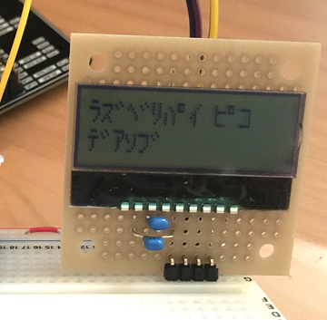|I2C通信を利用しています。カタカナ表示に対応しました。|daichamame_aqm1602.py|
|SSD1306(OLED)|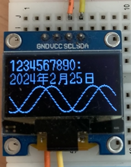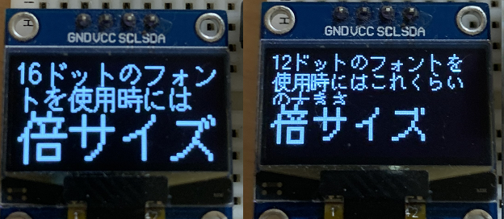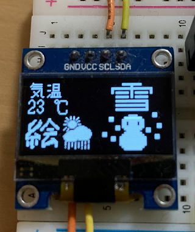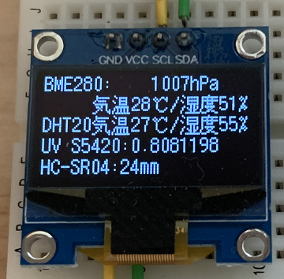|I2C通信を利用しています。<br>日本語は、フォントの情報を配列に持たせて表示させる仕組みで実装しています。<br>配列に持たせている為、多くのフォント情報は持てませんが、決まった単語を表示する用途などで利用できると思います。|daichamame_ssd1306.py|
|Waveshare 2.66inch E-Paper|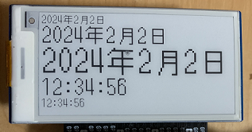16ドットのフォントを別途、用意して表示させた例です。<br>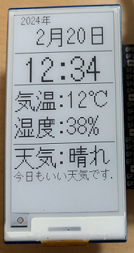アイコンを表示した例です。<br>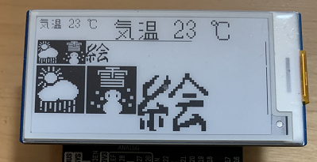カレンダーレイアウトを表示した例です。フォントサイズは16ドットです。センサーやネットワークから値を取得して表示させてもよいと思います。<br>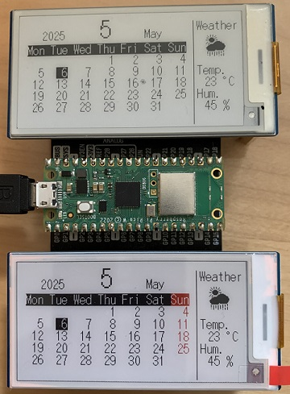|SPI通信を利用しています。<br>日本語処理ははSSD1306のモジュールと同様です。<br>簡易的に日本語を表示させる仕組みで実装しています。<br>16ドット、2倍角、3倍角の大きさで表示しています。|daichamame_epd266.py|
|Waveshare Pico LCD 1.3|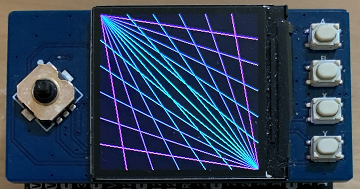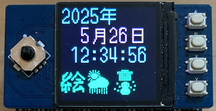下半分をスクロールしています。この向きで使用すると幅が240ピクセル、高さが320ピクセルとなります。<br>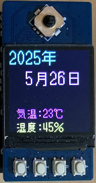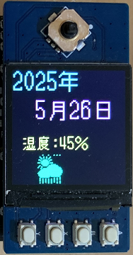|ジョイスティックと4つのボタンがコンパクトに収まっています。LCDのコントローラは、ST77789VWです。<br>表示領域は、幅、高さとも240ピクセルですが、スクロールさせることで、240-320の部分を表示させることができます。<br>16ビットと24ビットのbitmap画像を表示できるようにしています。|daichamame_picolcd13.py|
|MSP2807(ILI9341)|線を引いてみます。<br>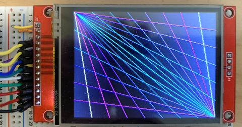ビットマップファイルを表示しています。<br>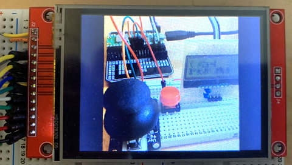８色のボタンを配置し、ボタンを押すと左上に座標と押されたボタンを表示します。<br>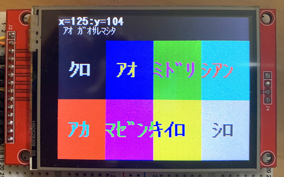|簡易のボタン関数を作っています。タッチをした際の座標取得で、ボタンのインデックス番号を取得できます。<br>16ビットと24ビットのbitmap画像を表示できるようにしています。<br>VCC:3V3(OUT)<br>GND:GND<br>CS:9 <br>RST:13<br>DC:8/DIN<br>MOSI(SDI):11<br>CLK:10<br>LED:VCC<br>DO / MISO(SDO):12 <br>T_CLK:18<br>T_CS:17<br>T_DIN:19<br>T_DO:16<br>T_IRQ:20
|daichamame_ili9341.py|
|FMラジオモジュール RDA5807||I2C通信を利用しています。<br>バンドは、76–108 MHzに設定しています。<br>ボリュームと、周波数の設定が使用できます。|daichamame_rda5807.py|
|DFPlayer mini|以下は、dfplayer_ssd1306.pyを実行した時の画面<br>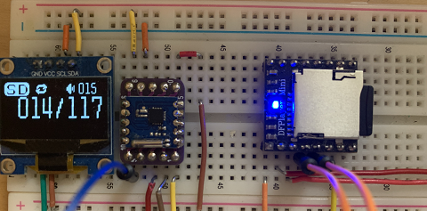|基本的なコマンドを利用できるようにしています。|daichamame_dfplayer.py|
|音声合成LSI ATP3011F4-PU||接続方法にはUART,I2C,SPIがありますが、I2Cを利用しています。|daichamame_atp3011f4.py|
|温湿度センサー DHT20||I2C通信を利用しています。温度と湿度を取得します。|daichamame_dht20.py|
|温湿度・気圧センサ BME280||I2C通信を利用しています。温度、湿度、気圧を同時に取得します。|daichamame_bme280.py|
|超音波距離センサー HC-SR04||対応電圧が3v-5.5vに変更となった2020版のセンサーを使用しています。<br>測定距離はミリメートル|daichamame_hcsr04.py|
|ジョイスティック||メニュー操作を想定したジョイスティック制御です。<br>方向キーの値取得にADCを2つ使用し、スイッチボタンにGPIO22を使用しています。|daichamame_joystick.py|
|ロータリーエンコーダ||24クリックのメカニカルロータリエンコーダを利用して作成<br>方向の取得と、指定した範囲で値の取得|daichamame_rotalyencoder.py|
|NEC方式 赤外線受信|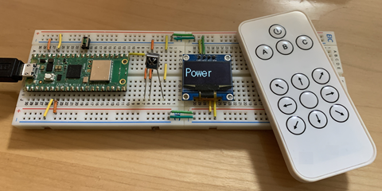|[NEC方式IR受信モジュールの詳細はこちら](docs/IRNEC.md)||
|Wi-Fi||Wi-Fiへの接続<br>NTPサーバからデータ取得しRTCに登録<br>HTTPリクエストの結果をファイル出力またはメモリに保持|daichamame_net.py|
|フォントローダ|東雲フォントの16ドットを利用した表示<br>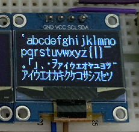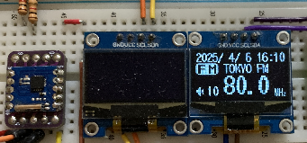|JIS X 0201のコード体系（半角文字、半角カナ）のビットマップフォントをリストに取り込むことができます。daichamame_ssd1306.pyのモジュールと一緒に利用することで、以下のような表示ができます。|fontloader.py|


## ディレクトリ構成
```
/
├─ docs/           # デバイスごとの詳細説明・配線図
├─ examples/       # アプリケーション例
├─ img/            # サムネイル画像
├─ lib/            # 各デバイスのモジュール群
└─ samples/        # 動作確認用プログラム
```
## アプリケーション例
| アプリケーション | 説明 | アプリファイル |
|---------|----------|------|
|FMラジオ + 赤外線リモコン アプリケーション|OLED（SSD1306 I2C）<br>FMラジオモジュール RDA5807H <br>赤外線リモコン OE13KIR<br>赤外線受信モジュール OSRB38C9AA<br>を使用<br>[詳細](docs/radio_with_ssd1306_and_ir.md)|[Radio with SSD1306 + IR Remote](examples/ex_radio_app_ir.py)|
|タッチパネルで操作するFM DSP ラジオ|MSP2807(ILI9341)<br>FMラジオモジュール RDA5807H<br>を使用 <br>|[Radio with MSP2807 (ILI9341)](examples/ex_radio_app_touch.py)|
|Waveshare Pico LCD 1.3 で操作する DSPラジオ|Waveshare Pico LCD 1.3<br>FMラジオモジュール RDA5807H<br>を使用<br>[詳細](docs/radio_with_waveshare_pico_lcd.md)|[Radio with Waveshare Pico LCD](examples/ex_radio_app_picolcd.py)|


## その他
Raspberry Pi Pico向けのアイコンを作成するために、PythonのKivyでツールを作成しています。

[ドット絵つくる(https://github.com/daichamame/kv-dot_e_maker)](https://github.com/daichamame/kv-dot_e_maker)

## 更新履歴
  * 2026年 3月
    - READMEを整理
  * 2026年 2月
    - プログラムが増えてきた為、examplesフォルダ（アプリ例）、samplesフォルダ（モジュール動作確認用）を作成し、プログラムを整理    
    - NEC方式の赤外線用のモジュールを追加
  * 2025年 9月
    - ILI9341 + XPT2046のモジュールを追加
  * 2025年 8月
    - Pico LCD 1.3のモジュール更新（文字装飾（太字処理）,改行位置調整）
  * 2025年 5月
    - Pico LCD 1.3 の表示用モジュール追加
    - 2.66inch e-Paperの赤色処理追加、JIS X 0201の文字表示対応、その他処理修正
  * 2025年 4月
    - WiFiのモジュールを追加
    - SSD1306モジュールにJIS X 0201の半角文字表示用関数追加
    - ロータリーエンコーダのモジュールに現在の値を設定する関数を追加
    - ビットマップフォントデータの読み込み処理追加
  * 2025年 3月
    - ロータリーエンコーダのモジュールを追加
  * 2025年 2月
    - DFPlayer miniのモジュールを追加
  * 2024年11月
    - ジョイスティック用のモジュールを追加
    - FMラジオ RDA5807MS　用のモジュールを追加
    - SSD1306モジュールに16x16のアイコン表示を追加
  * 2024年6月
    - I2Cで使用しているピンをデフォルトのピン(SDA=4,SCL=5)へ変更、また初期処理時に指定できるようにした
    - 超音波距離センサー HC-SR04モジュール追加
  * 2023年11月
    - 新規作成

## ライセンス

MIT License  
外部ライブラリやデバイスデータはユーザー自身で取得してください。
