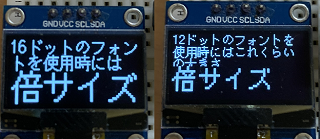

# Raspberry Pi Picoで動かすMicroPythonのプログラム集

### 更新履歴 ###
  * 2025年 5月
    - Pico LCD 1.3 の表示用モジュール追加
    - 2.66inch e-Paperの赤色処理追加、JIS X 0201の文字表示対応、その他処理修正
  * 2025年 4月
    - WiFiのモジュールを追加
    - SSD1306モジュールにJIS X 0201の半角文字表示用関数追加
    - ロータリーエンコーダのモジュールに現在の値を設定する関数を追加
    - ビットマップフォントデータの読み込み処理追加
  * 2025年 3月
    - ロータリーエンコーダのモジュールを追加
  * 2025年 2月
    - DFPlayer miniのモジュールを追加
  * 2024年11月
    - ジョイスティック用のモジュールを追加
    - FMラジオ RDA5807MS　用のモジュールを追加
    - SSD1306モジュールに16x16のアイコン表示を追加
  * 2024年6月
    - I2Cで使用しているピンをデフォルトのピン(SDA=4,SCL=5)へ変更、また初期処理時に指定できるようにした
    - 超音波距離センサー HC-SR04モジュール追加
  * 2023年11月
    - 新規作成

## ディスプレイ

日本語表示をするために作成しています。

### AQM1602
* ファイル名:daichamame_aqm1602.py
* I2C通信を利用しています。カタカナ表示に対応しました。カタカナを利用する場合には半角カタカナを使います。

### OLED SSD1306
* ファイル名:daichamame_ssd1306.py
* I2C通信を利用しています。
* 日本語は、フォントの情報を配列に持たせて表示させる仕組みで実装しています。 
配列に持たせている為、多くのフォント情報は持てませんが、決まった単語を表示する用途などで利用できると思います。

* 12ドットと16ドットのフォントを別途、用意して表示させた例です。 

* アイコンを表示した例です。(ssd1306_bitmap.py)

* アイコンを作成するために、PythonのKivyでツールを作成しています。

[ドット絵つくる(https://github.com/daichamame/kv-dot_e_maker)](https://github.com/daichamame/kv-dot_e_maker)

### Waveshare 2.66inch E-Paper
* ファイル名:daichamame_epd266.py
* SPI通信を利用しています。
* 日本語処理ははSSD1306のモジュールと同様です。
簡易的に日本語を表示させる仕組みで実装しています。 
16ドット、2倍角、3倍角の大きさで表示しています。

* 16ドットのフォントを別途、用意して表示させた例です。

* アイコンを表示した例です。

* カレンダーレイアウトを表示した例です。フォントサイズは16ドットです。センサーやネットワークから値を取得して表示させてもよいと思います。

### Waveshare Pico LCD 1.3
* ファイル名:daichamame_picolcd13.py
* ジョイスティックと4つのボタンがコンパクトに収まっています。LCDのコントローラは、ST77789VWです。
* 表示領域は、幅、高さとも240ピクセルですが、スクロールさせることで、240-320の部分を表示させることができます。
* 16ビットと24ビットのbitmap画像を表示できるようにしています。

下半分をスクロールしています。
この向きで使用すると幅が240ピクセル、高さが320ピクセルとなります。

## 音声合成LSI
### ATP3011F4-PU
* ファイル名:daichamame_atp3011f4.py
* 接続方法にはUART,I2C,SPIがありますが、I2Cを利用しています。

## 各種センサー

### 温湿度センサー(DHT20)
* ファイル名:daichamame_dht20.py
* I2C通信を利用しています。温度と湿度を取得します。

### 温湿度・気圧センサ(BME280)
* ファイル名:daichamame_bme280.py
* I2C通信を利用しています。温度、湿度、気圧を同時に取得します。

### 超音波距離センサー(HC-SR04)
* ファイル名:daichamame_hcsr04.py
* 対応電圧が3v-5.5vに変更となった2020版のセンサーを使用しています。 
測定距離はミリメートル

## ラジオモジュール ##
### FMラジオモジュール RDA5807MS ###
* ファイル名：daichamame_rda5807.py
* I2C通信を利用しています。
* バンドは、76–108 MHzに設定しています。
* ボリュームと、周波数の設定が使用できます。

## ジョイスティック ##
* ファイル名：daichamame_joystick.py
* ジョイスティック制御、メニュー操作を想定しています。
* 方向キーの値取得にADCを2つ使用し、スイッチボタンにGPIO22を使用しています。

## DFPlayer mini ##
* ファイル名：daichamame_dfplayer.py
* 基本的なコマンドを利用できるようにしています。
* 以下は、dfplayer_ssd1306.pyを実行した時の画面です。

## ロータリーエンコーダ ##
* ファイル名：daichamame_rotalyencoder.py
* 24クリックのメカニカルロータリエンコーダを利用して作成
* 方向の取得と、指定した範囲で値の取得

## その他 ##
### Wi-Fi ###
* ファイル名:daichamame_net.py
* Wi-Fiへの接続
* NTPサーバからデータ取得しRTCに登録
* HTTPリクエストの結果をファイル出力またはメモリに保持

### フォントローダ ###
* ファイル名：fontloader.py
* JIS X 0201のコード体系（半角文字、半角カナ）のビットマップフォントをリストに取り込むことができます。daichamame_ssd1306.pyのモジュールと一緒に利用することで、以下のような表示ができます。

東雲フォントの16ドットを利用した表示

文字以外に、ビットマップのアイコンも表示

