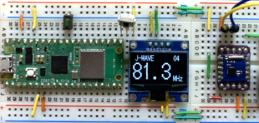

# FMラジオ + 赤外線リモコン アプリケーション  
（`examples/ex_radio_app_ir.py`）

このアプリケーションは、  
**FMラジオモジュール RDA5807** と  **NEC方式 赤外線リモコン受信モジュール**、そして **SSD1306 OLED** を組み合わせて、  
**赤外線リモコンで FM ラジオを操作できる**ようにしたものです。

OLED に局名・周波数・音量を表示しながら、  
リモコンの上下左右キーで操作できます。

---

## 使用デバイス

- **RDA5807**（FMラジオ DSP モジュール）
- **SSD1306 OLED（I2C）**
- **NEC方式 赤外線受信モジュール（OSRB38C9AA など）**
- **赤外線リモコン（NEC方式のもの。例：OE13KIR）**
- ステレオミニジャック（アンプ・スピーカー接続用）

---

## 配線

### I2C（OLED + RDA5807）
| Pico | デバイス | 備考 |
|------|----------|------|
| GP4  | SDA      | I2C0 |
| GP5  | SCL      | I2C0（400kHz） |

### 赤外線受信
| Pico | デバイス |
|------|----------|
| GP16 | IR受信モジュール OUT |

### オーディオ
- RDA5807 の **LR 出力 → ステレオミニジャック**
- GND は共通

---

## 操作方法（リモコン）

このプログラムでは、赤外線リモコンとして **OE13KIR** を使用した例になっています。

OE13KIR を使用した場合のキー割り当ては以下の通り：

| 操作 | コマンド値 | 動作 |
|------|------------|------|
| 左   | `0x08` | 前の局へ切り替え |
| 右   | `0x01` | 次の局へ切り替え |
| 上   | `0x05` | 音量アップ（0〜15） |
| 下   | `0x00` | 音量ダウン |

※ NEC方式のリモコンであれば使用できますが、  
　**リモコンごとにコマンド値が異なる場合があります。**
　**OE13KIRにおいてもロットによって異なるかもしれません。**

まずは サンプルプログラム(samples)`ir_nec_ssd1306.py`を動かして値を確認してください。取得したアドレスとコマンドをOLEDに表示します。

変更する際には、  
`ex_radio_app_ir.py` 内の `cmd == 0xXX` の部分を  
実際のリモコンの値に合わせて書き換えてください。


---

## OLED 表示内容

- 局名（例：TOKYO FM、J-WAVE など）
- 周波数（例：80.0 / 81.3 / 82.5 / 90.5 / 91.6 / 93.0 MHz）
- 音量（00〜15）

フォントは `fontloader` を使って BDF フォントを読み込み、  
8×16 ドットフォント（shnm8x16r.bdf） を使用しています。

---

## 主な動作の流れ

1. **フォント読み込み**
2. **IR受信モジュールの初期化**
3. **SSD1306 OLED の初期化**
4. **RDA5807 の初期化（周波数・音量設定）**
5. **100ms タイマーで main_loop を周期実行**
6. **リモコン入力を NEC デコード**
7. **入力に応じて周波数・音量を変更**
8. **OLED 表示を更新**

---

## コードのポイント

- **NEC赤外線デコード**  
  `daichamame_ir_nec_decoder.IRNECReceiver` を使用  
  → コマンド値だけ取得して分岐処理

- **局リストは配列で管理**  
  ```python
  freq = [80.0,81.3,82.5,90.5,91.6,93.0]
  fm_name = ["TOKYO FM ", "J-WAVE ", ...]
  ```

- **局の切り替えは Python 的な条件式で簡潔に記述**  
  ```python
  self.ct = (self.ct-1)*(self.ct > 0) + (len(self.freq)-1)*(self.ct == 0)
  ```

- **OLED 表示は update_display() に集約**

- **タイマー割り込みで UI を常時更新**  
  → メインループを持たず、イベント駆動的に動作

---

### 実行方法

このアプリケーションを動かすには、使用するモジュールとフォントファイルを  
Raspberry Pi Pico にコピーしておく必要があります。

#### 1. 必要なモジュールを `lib/` に配置
以下のファイルを Pico の `lib/` フォルダへコピーします。

- `daichamame_rda5807.py`
- `daichamame_ir_nec_decoder.py`
- `daichamame_ssd1306.py`
- `fontloader.py`
- その他、依存モジュール

#### 2. フォントファイルを `/font/` に配置
OLED 表示に使用するフォントとして、  
**東雲フォント（Shinonome Font）に含まれる `shnm8x16r.bdf`** を使用します。

以下のように Pico の `/font/` フォルダにコピーしてください。

```
/font/shnm8x16r.bdf
```

※ 東雲フォントはフリーの BDF フォントで、  
　公式配布物から `shnm8x16r.bdf` を取得して使用します。

#### 3. アプリケーション本体を Pico にコピー
`examples/ex_radio_app_ir.py` を Pico のルート（`/`）にコピーします。

#### 4. Thonny などから Pico に接続して実行
```python
# ex_radio_app_ir.py を開いて実行
```

#### 5. 自動起動したい場合
`ex_radio_app_ir.py` を `main.py` にリネームして Pico に配置すると、  
起動時に自動実行されます。


## 補足

- 使用するリモコンの NEC コードは `daichamame_ir_nec_decoder` で取得できます  
- 局リストは地域に合わせて書き換えてください  
- OLED のフォントは `/font/` 以下の BDF を使用  
- スピーカーの音量は外部アンプ側で調整してください  
