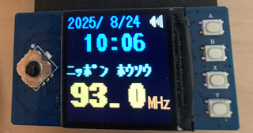

# Waveshare Pico LCD 1.3 で操作する FMラジオ

Waveshare Pico LCD 1.3 と RDA5807 FM チューナーを使用した  
**割り込み駆動・常駐型の DSP ラジオ** です。

- Pico LCD 1.3 による UI 表示  
- RDA5807 による FM ラジオ受信  
- Wi-Fi（2.4GHz）接続  
- NTP による RTC 同期  
- 割り込みによるボタン操作  
- 画面スリープ機能  
- システム情報表示（RAM / ファイルシステム）

---

## 機能概要

| 機能 | 内容 |
|------|------|
| FM ラジオ受信 | RDA5807 を使用（I2C） |
| ボリューム調整 | 0〜15、アイコン表示あり |
| チャンネル切替 | 東京の主要局をプリセット |
| 時計表示 | NTP 同期、秒表示 ON/OFF |
| 画面 ON/OFF | 手動切替＋自動スリープ |
| システム情報 | RAM / FS の使用量表示 |
| 割り込み駆動 | 全ボタンが IRQ で動作 |
| 常駐型 | タイマー2本で UI 更新 |

---

## 使用デバイス

### ● Waveshare Pico LCD 1.3  
- SPI 接続  
- 240×240  
- ボタン・ジョイスティック付き  

### ● RDA5807 FM チューナー  
- I2C 接続  
- CH0（SDA=GP4, SCL=GP5）  
- 通信速度：100kHz  

---

## 配線

| デバイス | Pico ピン |
|----------|-----------|
| RDA5807 SDA | GP4 |
| RDA5807 SCL | GP5 |
| 電源 | 3.3V / GND |

LCD は Waveshare Pico LCD 1.3 の標準接続を使用します。 

---

## 必要なモジュール

以下の独自モジュールを `/` に配置してください：

- `daichamame_picolcd13.py`
- `daichamame_rda5807.py`
- `daichamame_net.py`
- `fontloader.py`

フォントは `/font/` フォルダに配置：

## ボタン操作（Pico LCD 1.3）
|ボタン	|表示	|動作|
|-|-|-|
|A ボタン	|A	|システム情報表示|
|B ボタン	|B	|秒表示 ON/OFF|
|X ボタン	|X	|画面 ON/OFF|
|Y ボタン	|Y	|ミュート（音量0に）|
|ジョイスティック 上	|↑	|ボリューム UP|
|ジョイスティック 下	|↓	|ボリューム DOWN|
|ジョイスティック 左	|←	|前の局へ|
|ジョイスティック 右	|→	|次の局へ|
|ジョイスティック 中央	|●	|（未使用）|

## 🖥 画面表示
日付（YYYY/MM/DD）

時刻（HH:MM:SS または HH:MM）

FM 周波数（MHz）

放送局名

音量アイコン（5段階）

自動スリープ（初期値：60秒）

## タイマー構成
|タイマー	|周期	|内容|
|-|-|-|
|date_timer	|1000ms	|RTC 更新・スリープ管理|
|display_timer	|200ms	|UI 差分描画|
## プログラム構造
割り込み（IRQ）  
ボタン入力はすべて IRQ で処理し、UI 更新フラグを立てるだけにすることで高速化。

差分描画（update_area）  
1:日付、2:時刻、4:周波数、8:音量、16:システム情報
必要な部分だけ描画して負荷を軽減。

常駐型  
メインループは存在せず、タイマーと IRQ のみで動作。

## 実行方法
必要ファイルを Pico にコピー

env.py を設定

Pico を再起動

自動で Wi-Fi 接続 → NTP 同期 → ラジオ起動

## ライセンス

MITライセンス