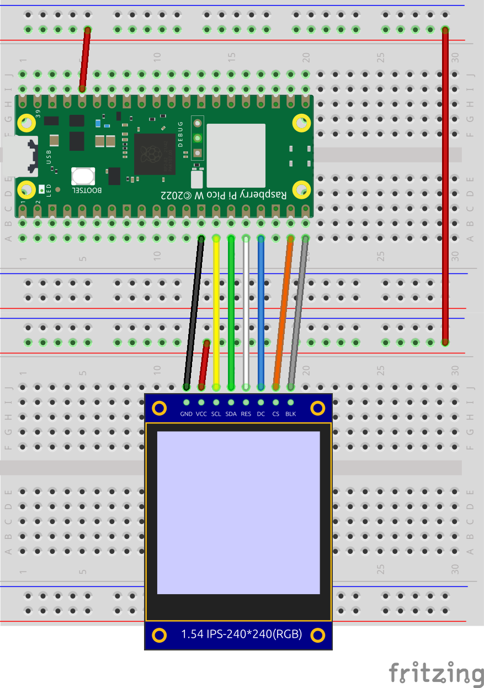
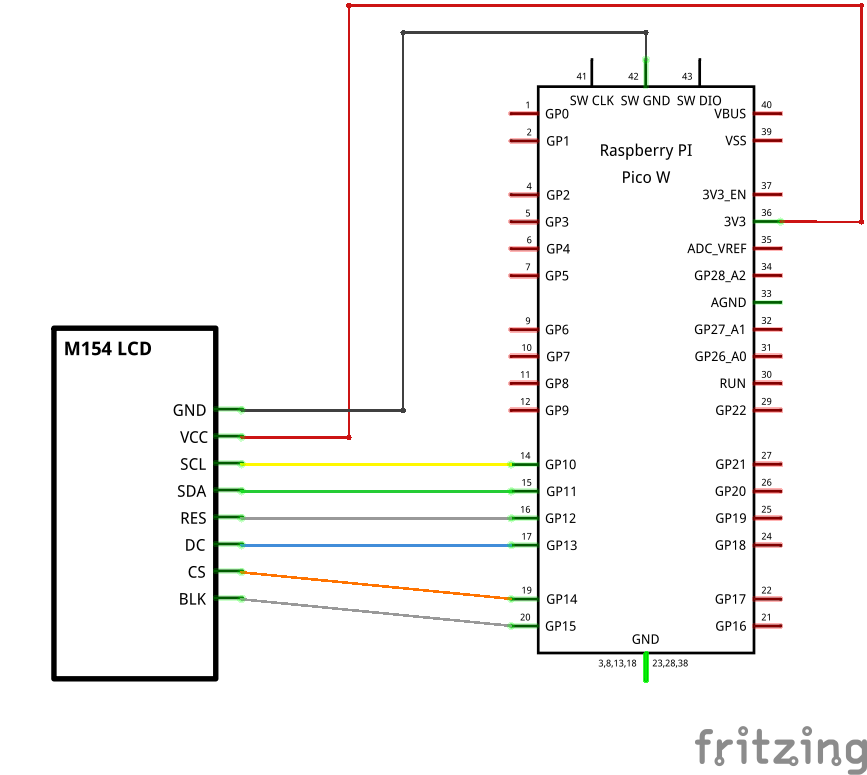

# MicroPython ST7789V Driver for Raspberry Pi Pico  
**1.54インチ 240×240 TFT M154‑240240‑RGB（ST7789V）向け 実装ガイド**

このモジュールは、Raspberry Pi Pico と 制御チップST7789V を動作させるための軽量 MicroPython ドライバです。  

---

## 1. 対応デバイス
- Raspberry Pi Pico / Pico W  
- 1.54インチ 240×240ドットカラーグラフィックTFT M154-240240-RGB(ST7789V)
- MicroPython  

---

## 2. 配線（ST7789 → Raspberry Pi Pico）

Fritzing で作成した配線図を以下に掲載しています。  
**まずは配線図を参照し、Pico 側のピン番号を合わせてください。**





---

## 3. ピン説明（ST7789V → Pico）

| ST7789V | Pico GPIO | 説明 |
|---------|-----------|------|
| SCL | **GP10** | SPI1 SCK |
| SDA | **GP11** | SPI1 TX |
| RES | **GP12** | GPIO |
| DC | **GP13** | GPIO |
| CS | **GP14** | GPIO |
| BLK | **GP15** | PWM/GPIO |

---

## 4. モジュールの特徴
- 関数ベースの軽量ドライバ  
- SPI1 専用設計  
- RGB565 バッファ描画に対応  
- 基本描画（点・線・矩形・塗りつぶし）  
- 日本語テキスト描画（外部フォント方式）  

---

## 5. インストール
```
/lib/daichamame_st7789.py
/fonts/（外部取得フォント）
```

---

## 6. 使い方（基本）

### 6.1 初期化例(東雲フォントのBDFファイルを読み込み例)
```python
import daichamame_st7789
import fontloader
fnt=fontloader.FontLoader("/font/shnm8x16r.bdf") # 東雲フォントのBDFファイルを読み込む
shnmfont=fnt.load_font()
lcd=daichamame_st7789.ST7789V(font_array=shnmfont,font_size=16,rotate=0)
lcd.init()
```

---

### 6.2 描画例
```python
lcd.clear() # 画面クリア
lcd.set_screen(65535) # 明るさを設定
lcd.print(0,0,"ST7789V ｻﾝﾌﾟﾙ",0xffffff) # 文字を表示
lcd.line(50, 50,100,100,0xff00ff) # 線を描く
```

---

## 7. API リファレンス
- `init()	# 初期処理`
- `reset() # HWリセット`
- `sw_reset() # SWリセット`
- `sleep_in() # スリープイン`
- `sleep_out() # スリープアウト`
- `init_scroll() # スクロール定義初期化`
- `set_scroll(tfa,vsa,bfa) # スクロールエリア定義`
- `scroll(num) # スクロール`
- `clear(color) # 指定色で初期化`
- `display_off() # ディスプレイオフ`
- `display_on() # ディスプレイオン`
- `print(x,y,buf,color,bgcolor,ratio,bold) # 文字を表示`
- `line(sx,sy,ex,ey,color) # 線を描く`
- `rect(x,y,width,height,color) # 四角形を描く`
- `draw_icon(x,y,buf,color,size,bgcolor,ratio) # アイコン(32x32 or 16x16)を描く`
- `draw_bitmap(file) # ビットマップ画像ファイルを表示`
- `set_screen(l) # 0〜65535 で明るさ調整`
- `fade_to(target,step,delay) # 徐々に明るさを調整`

---

## 8. ライセンス
MIT License  

